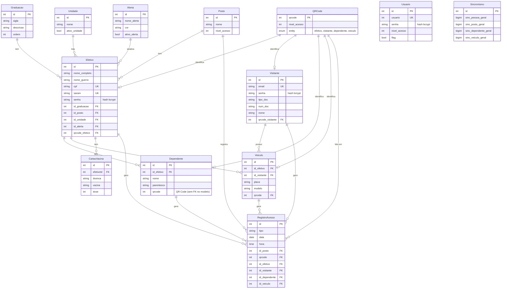

# SCA — Sistema de Controle de Acesso (backend)

[](https://github.com/j-andrade0/sca-backend/actions/workflows/ci.yml)

> **English summary:** REST API for an access-control system (people, visitors, dependents, vehicles, QR codes, access
> logs, alerts), built in Node.js 20 / Express / Sequelize / MySQL with JWT authentication and per-route access levels,
> Swagger docs and Docker Compose. It was the backend of the project that won 1st place in a Software Engineering
> course hackathon at UniEVANGÉLICA (Nov 2023); I built it with Pedro Rodrigues, as part of a larger team. In 2026 I
> added automated tests (Vitest and supertest), CI on GitHub Actions, environment-based configuration
> (`.env.example`), a self-contained Docker Compose setup, shared pagination and configurable CORS, and the access level
> of each route is derived from the signed JWT. Quick start: `cp backend/.env.example backend/.env`, edit it, then
> `docker compose --env-file backend/.env up --build` and open <http://localhost:3000/doc/>.

## Contexto

O SCA foi desenvolvido no hackathon do curso de Engenharia de Software da UniEVANGÉLICA, apresentado em **17/11/2023**,
onde o projeto ficou em **1º lugar**. O time era grande; o **backend foi feito em dupla**, por mim e por Pedro Rodrigues
([@PedroRodrigues-dev](https://github.com/PedroRodrigues-dev)). O cenário era o controle de acesso de uma base aérea:
cadastro de efetivos, dependentes, visitantes e veículos, QR Codes com nível de acesso, registro de entradas e saídas,
alertas e sincronismo com um aplicativo cliente. O código foi entregue à faculdade, que fez um fork e seguiu por conta própria.

**Origem da estrutura:** a organização do código (rotas → controllers → models, paginação, erros e Swagger) veio do
backend do meu TCC, o [COWorking](https://github.com/j-andrade0/COWorking), e foi adaptada aqui.

**Evolução em 2026:** em outubro de 2026 voltei ao projeto, sempre em PRs novos e **sem reescrever o histórico**
(os commits de 2023 continuam como estavam). O que existe hoje, além do código do hackathon:

- testes automatizados com Vitest e supertest (11 arquivos, 55 testes);
- CI no GitHub Actions: lint, formatação, testes e um job que sobe o `docker compose` com MySQL;
- configuração por variáveis de ambiente (`.env.example`): as configurações de exemplo da época do hackathon foram
  substituídas por elas;
- Docker Compose autocontido (a API é construída a partir do repositório, com MySQL como serviço);
- nível de acesso de cada rota derivado do JWT assinado;
- paginação compartilhada pelos 13 recursos e CORS configurável (`CORS_ORIGIN`);
- README com endpoints, diagrama ER e instruções de execução.

## Stack

Node.js 20 · Express 4 · Sequelize 6 · MySQL 8 · JWT (`jsonwebtoken`) · bcrypt · Swagger (`swagger-autogen` +
`swagger-ui-express`) · Docker / Docker Compose · ESLint · Prettier · Vitest + supertest · GitHub Actions

## Como rodar

### Com Docker (um comando)

```sh
cp backend/.env.example backend/.env      # edite DB_PASSWORD e JWT_SECRET_KEY (e, se quiser, SEED_ADMIN_*)
docker compose --env-file backend/.env up --build
```

Sobe um MySQL 8 (com healthcheck) e a API, construída a partir deste repositório; a API espera o banco ficar saudável.
Documentação (Swagger): <http://localhost:3000/doc/>. O arquivo `buildImage.sh` (do Pedro) publica a imagem no Docker
Hub; ele continua no repositório, mas o `docker compose` não depende mais dele.

### Sem Docker

Pré-requisitos: Node.js 20 e um MySQL com o banco (`DB_NAME`) já criado.

```sh
cd backend
npm ci
cp .env.example .env     # edite os valores (use aspas simples se tiverem $ ou outros caracteres de shell)
npm run dev              # carrega o .env, gera o Swagger e inicia com nodemon (precisa de bash)
# ou: set -a; . ./.env; set +a; npm start
```

As tabelas são criadas pelo Sequelize ao iniciar (`db.sync()`). A coleção [`insomnia-sca.json`](insomnia-sca.json) tem
as 62 requisições.

### Primeiro administrador

Não existe usuário padrão. Para criar o primeiro administrador (nível 2), defina `SEED_ADMIN_USER` (um número) e
`SEED_ADMIN_PASSWORD` no `.env`; ele é criado na inicialização se esse usuário ainda não existir. Depois, faça login em
`POST /usuarioLogin` e use o token.

### Variáveis de ambiente

| Variável              | Descrição                                                                        |
| --------------------- | -------------------------------------------------------------------------------- |
| `DB_NAME`             | nome do banco MySQL                                                              |
| `DB_USER`             | usuário do banco (no Docker Compose é sempre `root`)                             |
| `DB_PASSWORD`         | senha do banco                                                                   |
| `DB_HOST`             | host do banco (`localhost` por padrão; `mysql` no Docker Compose)                |
| `JWT_SECRET_KEY`      | chave de assinatura dos tokens; o servidor não inicia sem ele                    |
| `PORT`                | porta da API (padrão `3000`)                                                     |
| `CORS_ORIGIN`         | origens permitidas no navegador, separadas por vírgula, ou `*`; vazio = sem CORS |
| `SEED_ADMIN_USER`     | opcional: usuário (número) do administrador inicial                              |
| `SEED_ADMIN_PASSWORD` | opcional: senha do administrador inicial                                         |
| `DB_DIALECT`          | opcional; `sqlite` usa um banco em memória (é o que os testes usam)              |

## Autenticação e autorização

- `POST /usuarioLogin` (usuário + senha), `POST /efetivoLogin` (CPF + senha) e `POST /visitanteLogin` (e-mail + senha)
  devolvem `{ jwtToken, entity }`. O token vale 24 horas e deve ser enviado no header `Authentication`.
- O **nível de acesso é derivado do token assinado**: o de um _usuário_ vem da coluna `nivel_acesso`; o de _efetivo_ e
  _visitante_ vem do `nivel_acesso` do QR Code criado junto com eles.
- Sem token, token inválido ou expirado: `401`. Nível insuficiente: `403`. Hoje todas as rotas protegidas exigem nível 2.

## Endpoints

Todas as rotas de recursos exigem JWT com nível ≥ 2 (header `Authentication`); só os três logins e `/doc` são públicos.
O Swagger em `/doc` tem os corpos e as respostas.

| Recurso            | Rotas                                                              |
| ------------------ | ------------------------------------------------------------------ |
| Login (público)    | `POST /usuarioLogin`, `POST /efetivoLogin`, `POST /visitanteLogin` |
| Usuário            | `GET/POST /usuario`, `GET/PUT/DELETE /usuario/:id`                 |
| Efetivo            | `GET/POST /efetivo`, `GET/PUT/DELETE /efetivo/:id`                 |
| Visitante          | `GET/POST /visitante`, `GET/PUT/DELETE /visitante/:id`             |
| Dependente         | `GET/POST /dependente`, `GET/PUT/DELETE /dependente/:id`           |
| Veículo            | `GET/POST /veiculo`, `GET/PUT/DELETE /veiculo/:id`                 |
| QR Code            | `GET/POST /qrcode`, `GET/PUT/DELETE /qrcode/:qrcode`               |
| Registro de acesso | `GET/POST /registro_acesso`, `GET/PUT/DELETE /registro_acesso/:id` |
| Alerta             | `GET/POST /alerta`, `GET/PUT/DELETE /alerta/:id`                   |
| Posto              | `GET/POST /posto`, `GET/PUT/DELETE /posto/:id`                     |
| Graduação          | `GET/POST /graduacao`, `GET/PUT/DELETE /graduacao/:id`             |
| Unidade            | `GET/POST /unidade`, `GET/PUT/DELETE /unidade/:id`                 |
| Cartão de vacina   | `GET/POST /cartoesvacina`, `GET/PUT/DELETE /cartoesvacina/:id`     |
| Sincronismo        | `GET/POST /sincronismo`, `GET/PUT/DELETE /sincronismo/:id`         |

As listagens são paginadas (`?page=N`, 10 itens) e devolvem `pagination` com `prev_page`, `next_page`, `lastPage` e
`totalRegisters`. Ao criar um efetivo, o QR Code (com o nível informado) e um alerta de criação são gerados
automaticamente; visitantes, dependentes e veículos também recebem o QR Code. As respostas nunca incluem o hash da senha.

## Modelo de dados



## Testes e qualidade

```sh
cd backend
npm run lint          # ESLint (inclui no-undef)
npm run format:check  # Prettier
npm test              # Vitest + supertest, banco SQLite em memória (não precisa de MySQL nem de .env)
```

Os testes cobrem login (ok/falha), respostas 401 e 403 conforme o nível de acesso do token, respostas sem hash de senha,
paginação, criação de efetivo gerando QR Code e alerta, seed, CORS e as rotas de atualização. O
GitHub Actions roda isso em Node 20 e, em outro job, sobe o `docker compose` com MySQL de verdade e faz um teste de
fumaça (login do administrador, 401, 200 e 403).

> `swagger_output.json` é gerado (`npm run swagger`, e automaticamente por `npm start`, `npm run dev` e pelos testes) e
> não é versionado.

## Próximos passos

- Extrair um controller/serviço base para o CRUD dos 13 recursos e adicionar esquemas de validação do corpo das
  requisições.
- Migrar de `db.sync()` para migrations do Sequelize.
- Ampliar os testes automatizados para todos os recursos.
- Transformar `Dependente.qrcode` em chave estrangeira e implementar o sincronismo com o aplicativo cliente (hoje o
  sincronismo existe como tabela e rotas).

## Autores

Segundo o histórico do Git (74 commits em 2023: 51 meus, 22 do Pedro, 1 duplicado com outro nome):

- **José Antonio de Andrade Siqueira** ([@j-andrade0](https://github.com/j-andrade0)) — modelos, endpoints de usuário,
  ajustes nos controllers (efetivo, visitante, alerta, registro de acesso, QR Code), login de usuário/efetivo/visitante,
  middlewares de autenticação e autorização, paginação e geração automática de QR Code; revisão de 2026.
- **Pedro Rodrigues** ([@PedroRodrigues-dev](https://github.com/PedroRodrigues-dev)) — arquitetura inicial e a primeira
  versão dos controllers e rotas, Docker e deploy, Swagger, CORS e seeds, cartão de vacina.
